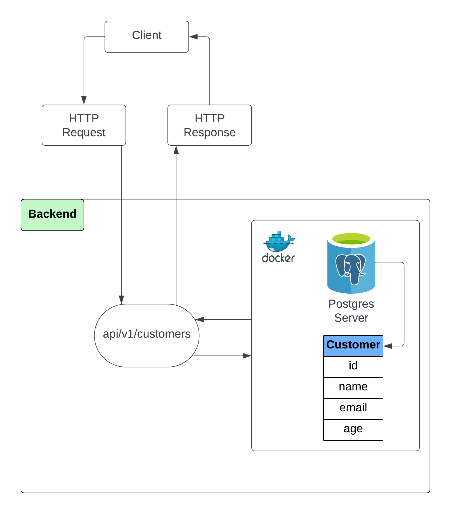

# My First Spring Boot Project
Welcome to the documentation for my Spring Boot project. In this repository, I've developed a basic Spring Boot application that integrates with a **PostgreSQL database**, all encapsulated within a **Docker container**. The project focuses on a single table, offering API endpoints for fundamental CRUD operations.

## Overview
This project serves as my introduction to Spring Boot, PostgreSQL, and Docker integration. The primary components are:  
**Spring Boot**: The foundation of the application, providing a framework for building robust Java applications.  
**PostgreSQL**: A powerful open-source relational database management system.  
**Docker**: Containerization technology to ensure consistency and portability across environments.

## Architecture
To better understand the structure of the project, refer to the network diagram provided below:  
